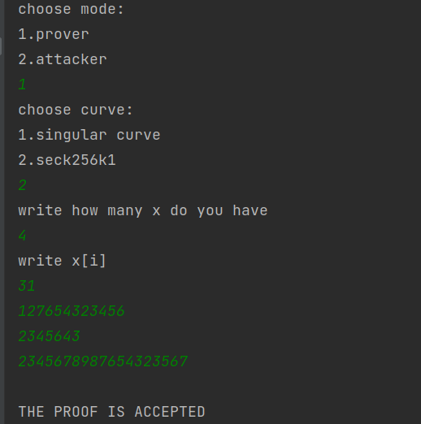
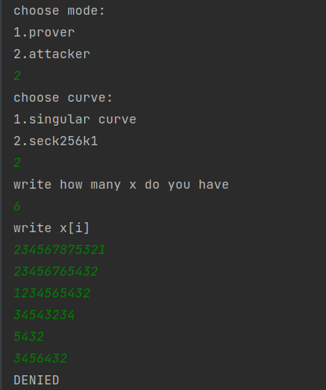
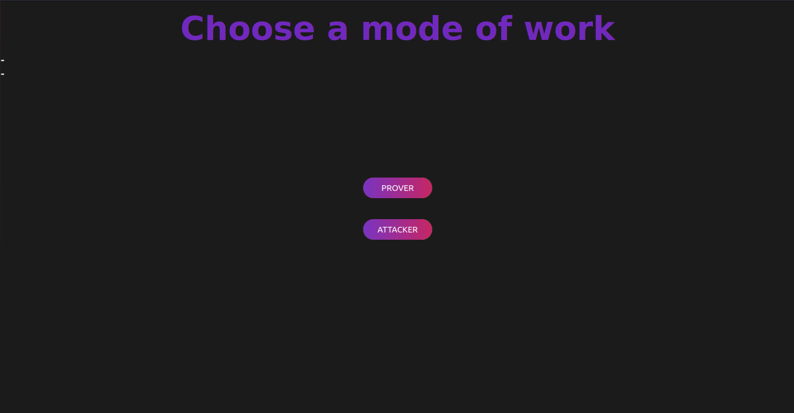
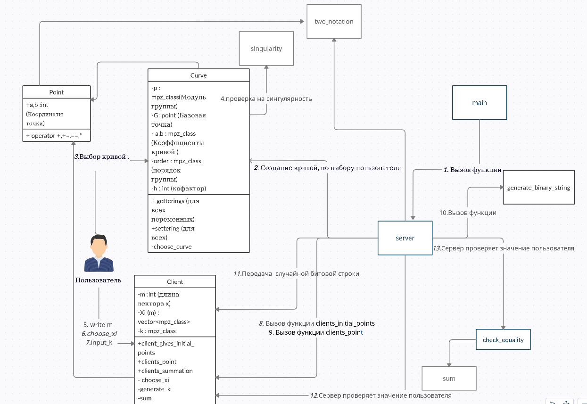

# authentication-protocol

<h2>Курсовая работа : </h2>

Навигация по репозиторию:

* документация - html/..  </br>
* реализация - realization/..   </br>
* демонстрация - demonstration/..   </br>
* логгирование (в формате jsonl) - Logging.jsonl   </br>
  <h3> рекомендуемое число секретов > 72 </h3>
  <h4>Внесенная модификация: </h4>
* Сравнение через xor - не дает никакой информации о времени сравнения ,что может позволить понять с какого
  символа/цифры ответ злоумышленника неправильный

- [x] Протокол <br/>
  

---

- [x] Атака повторного воспроизведения  <br/>
  

---

- [x] Визуализация  <br/>
  
  
  <br/>

---

- [x] UML-диаграмма  <br/>
  
  <br/>

---
<h3>Процесс отладки раундов протокола</h3>

- [x] R=[k]*G <br/>

```c++
R = curve.get_G() * k;
```

- [x] Yi =∑[-xi]*G <br/>

```c++
for (int i = 0; i < m; ++i) {
        mpz_class mult = (-xi[i]) % curve.get_order();
        while (mult < 0) {
            mult += curve.get_order();
        }
        Y[i] = curve.get_G() * mult;
    }
```

- [x] ( a1, ..., am ) ∈ {0, 1}m<br/>

```c++
std::random_device dev;
    std::mt19937 rng(dev());
    std::uniform_int_distribution<std::mt19937::result_type> dist6(
            0, std::numeric_limits<int>::max());

    int random = dist6(rng);
    mpz_class bit_string = random % static_cast<int>(pow(2, Y.size())); //длины m
```

- [x] s=k+aixi <br/>

```c++
s = k + (sum(binary_string)) % q;
```

- [x] R=[s]G+ ∑[ai]Yi

```c++
    Point sG = curve.get_G() * s;
Point d = sum(binary, Y) + sG;
bool flag = true;
for (size_t i = 0; i < d.x.get_str(2).length(); ++i) { flag |= d.x.get_str(2)[i] ^ R.x.get_str(2)[i]; }

for (size_t j = 0; j < d.y.get_str(2).length(); ++j) { flag |= d.y.get_str(2)[j] ^ R.y.get_str(2)[j]; }
return flag;
```
